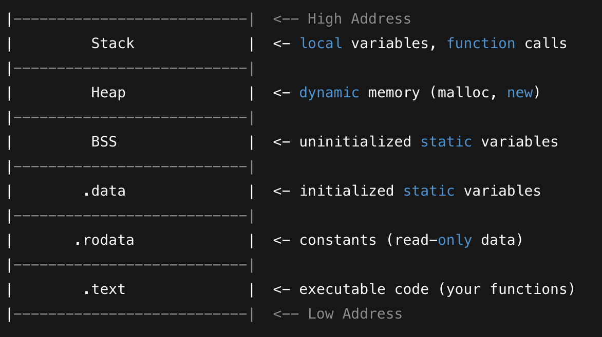
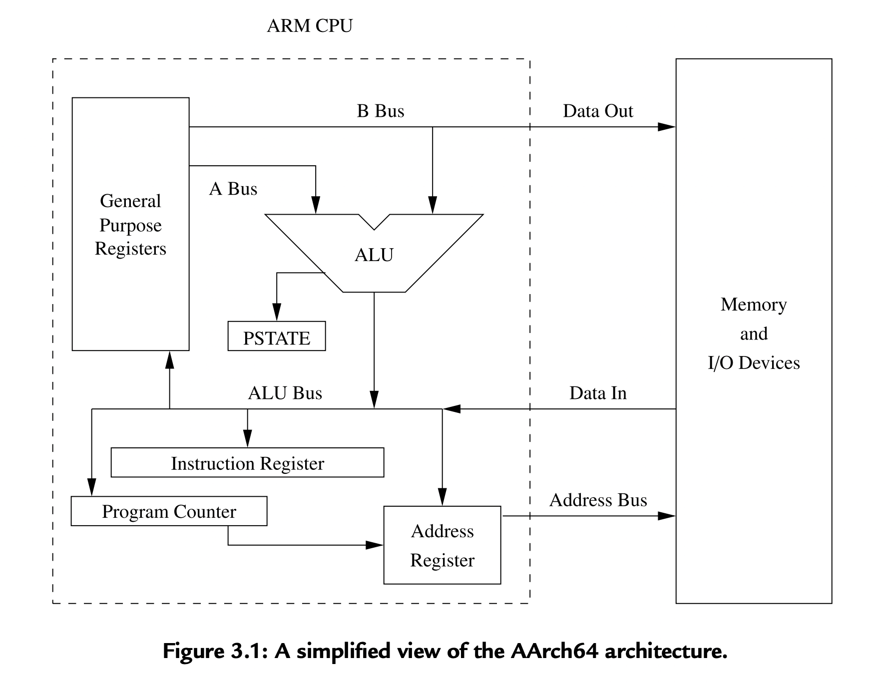

# Noether Assembly / Networking Project

C compiler: gcc netping.c -o netping

Compiler for Intel - or - ARM64 assembly   
```
brew install nasm
- or -
clang
```

clang -arch arm64 -o hello hello.s -no-pie   

## Simple Instruction Format

opcode destination_register, source1, source2

Example: 
```
add x1, x2, x3
```   
add - opcode   
x1 - destination_register   
x2 - source1   
x3 - source2   

## Simple ARM64 Instructions

put 10 in x0 - move immediate or register 
```
mov x0, #10
``` 
add
```
add x1, x2, x3
```   
subtract
```
sub x1, x2, x3
``` 
load from memory to register   
```
ldr x0, [x1]
``` 
store from register to memory  
```
str x0, [x1]
``` 
branch with link (call function) 
```
bl _printf
``` 
return from function 
```
ret
```  

## Assembly Program Structure

### Six Major Memory Regions in a Program
When your program runs, it gets loaded into memory. That memory is split into six keys sections:   



**.text section (Executable Instructions)**   
Contains machine code (compiled functions and instructions)   
Read only (so you can't accidentally overwrite your code)      

**.rodata (Read Only Data)**   
Contains constants and string literals   
Read-only: modifying them causes a segmentation fault   

**.data (Initialized Global/Static Variables)**    
Stores global/static variables that are explicitly initialized    

**.bss (Uninitialized Global/Static Variables)**   
Stores global/static variables that are not initialized explicitly

**Heap (Dynamic Memory)**    
Grows upward (toward higher memory)   
Used for malloc, new or dynamic memory allocation   
In C,   
```
int* p = malloc(10 * sizeof(int));
```    
You must manually free it later,   
```
free(p);
```   


**Stack (Function Calls, Local Variables)** 

When a function is called arguments are pushed into stack. The return address is saved. Local variables are allocated on the stack. The frame pointer (fp/x29) is updated.

Grows downward (toward lower memory)   
Stores: function parameters, return addresses, local variables    
     

### An assembly program consists of four basic elements  

#### Assembler Directives 
- These are instructions to the assembler not the cpu.
- They control how assembly code is turned into machine code.
- E.g., .section, .global, .data, .text, .ascii, .asciz, etc.

#### Labels
- Names followed by a colon (e.g., start: or _main:)
- Used to mark positions in code or memory.
- Useful for jumping or referring to data.

#### Assembly Instructions (Mnemonics)
- These are the actual CPU instructions, written in human-readable shorthand.
- Mnemonics are easier to remember than writing raw binary or hex code.
- E.g., mov x0, #0 or bl _printf

#### Comments     
- Starts with a // or @ or #
- Ignored by the assembler


### Program Layout

Historically, assembly programs were written in 80-character wide lines divided into four columns    

| Column | Width   | Purpose                               |
|--------|---------|----------------------------------------|
| 1      | 8 char  | Labels (optional)                      |
| 2      | 8 char  | Mnemonics (instructions)               |
| 3      | 16 char | Operands (registers, values, labels)   |
| 4      | 48 char | Comments                               |

This format made it easier to read and debug on old terminals and punch cards.   

#### The assembler needs 2 passes to resolve labels and addresses correctly.

Example:
```
_start:
    mov x0, #0
    b done      // jump to label "done"
    mov x0, #1

done:
    mov x1, #2

```
Here the label done: appears after it is used in the jump b done. The assembler must know where done is in memory to generate correct binary. But it can't know that on the first look - because done comes later.

### Assembler Directives

Assembler directives are commands to the assembler.They do not become part of your program's instruction -- instad they help control how the code is organized, stored, and processed. It starts with a dot - like .section, .data, .text, .global. They only affect how the assembler builds the final program.     

Example:   
```
.section .rodata        // Start a section for read-only data
msg: .asciz "Hello\n"   // Define a null-terminated string

.section .text          // Start code section
.globl _main            // Make _main visible to the OS (entry point)

_main:
    ...                 // Your assembly instructions here
```    

**.section .rodata** - Put the next data into the read only section (won't change at runtime).    
**msg:** - This is the label, used to refer to the string.   
**.asciz "Hello\n"** - Store the string "Hello\n" with a 0 byte at the end(C style string).   
**.section .text** - Start the instruction section.   
**.globl _main** - Tells the linker that _main is a global symbol (program's entry point).    

#### Memory Allocation

```
.section .rodata
msg: .asciz "Hello, world!\n"  ; 14 bytes (13 chars + null terminator)

.section .data
val: .word 42                  ; 4 bytes

.section .bss
.space 100                     ; reserve 100 bytes (uninitialized)

.section .text
_main:
    ; let's say 32 bytes of code
```    

### Section in Assembly

When you write a program in assembly, the code and the data you write are organised in sections. Think of a section like a room in a building - each one is meant to store a specific kind of thing:    
- Instruction/Code go in one room. 
- Variables and constants go in another room.
- Uninitialized data (just space for variables) goes in another.   

This organization helps OS load and manage your program efficiently.   

#### Common Sections in Assembly

**.text** section: This is where all your code go. Ex: mov, bl, ret, etc.   
**.data** section: Initialized data section. Stores global variables and constants that have intial values.   
**.bss** section: Uninitialized data section. Reserves space in memory but initializes to 0. This section doesn't appear in the executable files - it just tells the OS to allocate space at load time.    
**.section** section: The .section directive is more general. You can use it select one of the standard sections (.text, .bss, .data) or define custom sections.   
```
.section .rodata
msg: .asciz "Hello"   // Read-only string
```

### Storage Directives

In assembly, we don't use high level vaiables like in C(int x = 5;). Instead we use assembler directives like .byte, .word, etc. to manually allocate memory and optionally initialize it with data. These go into .data, .rodata, or .bss section depending on whether the data is initialized, read only or uninitialized.   


### Simplified View of the AArch64 architecture



The general purpose registers are the main working registers (X0-X30) that the CPU uses for computations, temporary storage, and function call conventions. Two of these register feed into the A Bus and B Bus, going into ALU.    
ALU performs arithmetic and logic operations. Output goes into ALU bus and also updates PSTATE.  

**PSTATE** stores status flags like:    
- Z(Zero): Set if the result is 0.
- N(Negative): Set if the result is negative.
- C(Carry) and V(Overflow)

The result from ALU is sent back to **General Purpose Registers** or to other units like the Instruction Register or Address Register. **Instruction Register** holds the currently executing instruction. Instructions are fetched from memory and decoded here before execution.    
Program counter are points to next instruction in memory. Gets updated after each instruction fetch (unless a branch or jump modifies it).    
Address register holds the memory address for data access (load/store). The value in this register is placed on the Address Bus. Address Bus carries the memory address from the CPU to the Memory and I/O Devices.    

**Data In / Data Out**  

Data Out: Used to write data from the CPU to memory/I/O.   
Data In: Used to read data from memory/I/O into the CPU.

**Memory and I/O Devices**  

External memory (RAM/ROM) and input/output devices that interact with CPU. They are connected via address and data buses.   

#### Simple Instruction Cycle 

ADD X0, X1, X2   ; X0 = X1 + X2   
Program Counter (PC) contains the address of the next instruction in memory. This address is sent via Address Bus to Memory. The instruction (ADD X0, X1, X2) is returned from the memory via Data In line and loaded into instruction register.    
The instruction register decodes the instruction and determines its an ADD operation with operand X1 and X2, result to be stored in X0. The control unit sends signals
to read X1 into the A Bus and read X2 into the B Bus.   
General Purpose Registers output the contents of X1 and X2 onto the A Bus and B Bus, respectively.    
The ALU performs the addition and the result is sent on the ALU Bus. PSTATE is updated. The result of ALU is written back into register X0.    
The PC is incremented to point to the next instruction. Cycle repeats as PC+4->PC.    

**AArch64 user registers**    

AArch64 ISA provides 31 general-purpose registers, which are called X0 through X30. Each store 64 bits of data. To use only lower 32(least significant bits), they are referred to as w0-w30. In general they are referred to as R0-R30.   
Registers R0-R7 are used for passing arguments when calling a procedure or function Registers R9-R15 are scratch registers and can be used at any time because no assumptions are
made about what they contain. They are called scratch registers because they are useful for
holding temporary results of calculations. Registers R16-R29 can also be used as scratch
registers, but their contents must be saved before they are used, and restored to their original
contents before the procedure exits.

**Frame Pointer**  

Frame pointer is a convention not a hardware rule. It is typically the register x29 in AArch64 (ARM64). It points to the base of current functions stack frame.    
When a function is called, it might save return address, store parameters, and allocate local variables. If these are pushed onto the stack, we need a way to access them later. There are two options:
- use sp(stack pointer), but it moves (not reliable)
- use fp(x29), which is set to a fixed location, making access easy and stable    

So, x29 helps us debug (see where stack frame starts), access local variables and parameters with consistent offsets or walk back up the call chain (stack unwinding in debuggers).    

If you compile with:
```
gcc -fomit-frame-pointer
```
Then the compiler won't use x29 as frame pointer    

**PSTATE Register**    

The PSTATE register(short for Processor State) is a special register in the ARM64 architechture that stores:    
- The current status of the processor
- The result of recent operations
- Various control flags    

Most parts of PSTATE are used by OS or for privileged instructions, but 4 bits are crucial for your program: **N, Z, C, V**. These 4 bits are called conditional flags and they're used to:    
- Reflect results of arithmetic/logic operations
- Guide conditional instructions (like jumps or branches)

**N** is Negative, set to 1 if the result is negative. **Z** is Zero, set to 1 if the result is zero. **C** is Carry, set to 1 if the result has a carry/borrow. **V** is Overflow, set to 1 if signed overflow occurs.

Example:
```
subs x0, x1, x2    ; x0 = x1 - x2
```
This will compute x1-x2 and set **NZCV** flags based on the result.   

Conditional Branch:
```
subs x0, x1, x2    ; set flags
b.eq label         ; branch to 'label' if Z == 1 (i.e. x1 == x2)
```
The instruction b.eq means "branch if equal", chich depends on Z=1. This way you can write simple logic like :
- if x == y -> do something
- if x < y -> do something else     

**Link Register**   

Link register x30 is a special purpose register. When your program calls a function (or subroutine), it needs to remember where to return after the function finishes. x30 is used to store the return address, i.e., the address where the program should come back after the function ends.    

Instructions like
```
BL some_function
```
BL means Branch with Link. It does two things:
- Saves the current address (return point) to x30
- Jumps to some_function
Then inside some function, when its done you can do:
```
RET
```
This tells the CPU: "Return to the address stored in x30"


**Stack Pointer**  

The stack is a special area of memory used to store temporary data like: function arguments, return addresses, local variables, saved register values. Think of it like a pile of plates, you always add or remove plates from the top.     
The stack pointer (sp) is a special register that always holds the address of the top of the stack. In ARM64, the stack grows downward - meaning when you add things, the address gets smaller.    
Let's say you're calling a function:
- The CPU stores the return address on the stack
- Local variables inside the function are also put on the stack
- The stack pointer moves downward to make space    

When the function ends, the local variables and return address are removed from the stack. **sp** moves upward to clean up. Example:
```
sub sp, sp, #16     // make space for two 64-bit values (2 * 8 bytes)
str x0, [sp]        // store x0 at top of stack
str x1, [sp, #8]    // store x1 next to it

// later...
ldr x0, [sp]        // restore x0
ldr x1, [sp, #8]    // restore x1
add sp, sp, #16     // clean up stack (pop)
```

**Zero Register**  

The zero register is a special register in ARM64 called:    
- xzr: for 64 bit operation
- wzr: for 32 bit operation

It always contains the value 0, and you cannot change it.     

Example: 
```
mov x1, xzr
```
xzr is not a normal register - it always returns 0. You are copying 0 into x1. Internally, both the stack pointer (sp) and the zero register (xzr) use the same binary encoding 31.     
But the CPU interprets 31 differently depending on the instruction. Some instructions treat register 31 as stack pointer, other treat it as zero register. 

**Program Counter**  

The program counter or pc is a special register in CPU that keeps track of where the program is in memory. It always contains the address of the next instruction the CPU will execute.     
Instructions in memory are stored in order like:    
```
0x1000: add x0, x1, x2
0x1004: sub x3, x4, x5
0x1008: mov x6, x7
```
When the CPU runs it, it looks at the current pc value, fetches the instructions at 0x1000(add x0, x1, x2), executes it, increments the pc by 4(because ARM64 instructions are 4 bytes long) and repeats the process with the next instruction.    

You can make the program jump to different parts of code using pc. You can put new address in pc, and the CPU will start executing from there. PC lets you:
- Jump to another function
- Skip over code
- Repeat a loop
- Handle conditions

Example psudo-assembly
```
adr x0, label      // Get address of `label` into x0
br  x0             // Jump to that address (set pc = x0)

...

label:
  mov x1, #42      // Code starts here after the jump
```


### Instruction components    

The AArch64 processor supports a relatively small set of instructions grouped into four basic instruction types. Many instructions have optional modifiers, which results in a very rich programming language.     
- Data processing
- Load/store
- Branching 
- System    

#### Setting and using condition flags

PSTATE is a special CPU register that contains status flags. Normal instructions don't affect flags:
```
add x0, x1, x2
```
This adds x1 + x2, and stores it in x0 but does not change any flags in PSTATE.
```
adds x0, x1, x2
```
Instruction with s suffix do affect flags. 

**Why set flags?**  

Because you can use them for conditional execution, like branching:
```
adds x0, x1, x2 // set flag based on result

beq label // branch (jump) if result was zero (Z = 1)
```

The basic unconditional branch: 
```
b label // always jump
```
But you can add conditional codes: eq, ne, lt, gt, ge, le, cs, mi
```
b.eq label   // branch if zero
b.ne label   // branch if NOT zero
b.lt label   // branch if less than (signed)
```

#### Immediate values

An immediate value is just a constant number you put directly into an instruction. 
```
mov x0, #5      // Move the number 5 directly into register x0
add x1, x1, #1  // Add 1 to x1
```
(#5 ,#1) - these are immediate values. There are two ways to use immediate values in GNU ARM64 assembly:

**Direct/Literal Immediate**  

You write directly with a # sign (the # is optional but helps readability)
```
mov x0, #42         // decimal
mov x1, #0xFF       // hexadecimal
mov x2, #0b1010     // binary
```
The assembler tries to encode this number directly inside the machine instruction.     
But there is a limit. Not all numbers can be encoded directly. For example, arithmetic instructions like add, mov, etc., usually only support 12-bit immediate values (0–4095 or a special pattern). If the value is too big (like #10000000000), this will fail. The assembler will give an error. To fix this, you need to use the second method:

**```ldr xN, =<immediate>``` Pseudo-instruction**  

This tells the assembler: "Put this value somewhere in memory and load it into register."     
```
ldr x0, =0xFFFFFFFFFFFFFFFF    // Load full 64-bit value
ldr x1, =main                  // Load address of symbol "main"
```
This is called a pseudo-instruction because there’s no actual LDR instruction like this in machine code. Instead, the assembler turns it into real instructions + data in memory.    
Behind the scenes, the assembler will:
- Put the value into a literal pool (a small area in memory),
- Generate code to load the value from memory into your register.

You can write number in several formats: decimal(#123), hex(#0x7B), binary(#0b1111011), and octal(#0173).


#### Addressing modes    
AArch64 is a load-store architecture. This means instructions that do calculation (add, multiply), only work with registers, not directly from memory. To use data from memory, you must first load it into register. After you're done with a value, you can store it back into memory.     

Example Workflow:
```
ldr x0, [mem1]      // Load value at mem1 into register x0
ldr x1, [mem2]      // Load value at mem2 into register x1
add x2, x0, x1      // Add x0 and x1, store result in x2
str x2, [result]    // Store x2 back into memory
```
You can transfer different sizes of data. Byte - 8 bits(ldrb, strb), halfword - 16 bits(ldrh, strh), word - 32 bits(ldr, str) - for w registers like w0, doubleword - 64 bits(ldr, str) - for x registers like x0.

**Computational Instructions**    
```
add x2, x0, x1      // x2 = x0 + x1
sub x3, x2, #10     // x3 = x2 - 10
```
These instructinos only use registers not memory.

**Addressing modes in Load/Store instructions**    

When using ldr or str, you need to tell the CPU where in memory to read from or write to. There are 3 main types of addressing modes (and a couple of extras).    

1. Register Offset: 
```
ldr x0, [x1, x2]    // address = x1 + x2
```

2. Immediate Offset:
```
ldr x0, [x1, #16]   // address = x1 + 16
// x1 does not change here
```

3. Pre-indexed:
```
ldr x0, [x1, #8]!   // x1 = x1 + 8, then load from [x1]
// x1 is updated first, then loaded 
```

4. Post-indexed:
```
ldr x0, [x1], #8    // load from [x1], then x1 = x1 + 8
// x1 is loaded first then updated
```

5. Literal Addressing:
```
ldr x0, =label      // Load the address of `label` into x0 (pseudo-instruction)
```

6. Pseudo Addressing (using =)
```
ldr x0, =0xABCDEF   // load a full 64-bit constant into x0
ldr x1, =myVar      // load the address of variable `myVar`
```

#### Load and store instructions

When you are working in AArch64 assembly (ARM64 bit), the ldr and str instructions are used to move data between memory and registers. There are three main types based on how much and what kind of data is being moved: 

**Single Register Load/Store**  

Moves one value between memory and a register. Load and  store example:    
```
ldr x0, [x1]     // Load 64-bit value from memory at x1 into x0
str x0, [x1]     // Store 64-bit value from x0 into memory at x1
```
It can be for 8 bit (ldrb, strb), 16 bit (ldrh, strh), 32 bit (ldr, str)w, 64 bit (ldr, str)x.

**Register Pair Load/Store**    

Moves two registers at once (a pair), which is more efficient for saving/restoring context (like function calls). Load and store example:
```
stp x0, x1, [sp, #-16]!  // Store x0 and x1 on the stack
ldp x0, x1, [sp], #16    // Load x0 and x1 from stack, then update sp
```

Often used for saving/returning function arguments or return values and stack frame management.    

**Atomic Load/Store**     

Provides atomic (thread safe) memory operations - meaning the operations cannot be interrupted, which is crucial for multithreaded programs. Load and store example:
```
ldxr x0, [x1]     // Load x0 from x1 atomically
stxr w2, x3, [x1] // Attempt atomic store of x3 into [x1]
```
Often used for implementing locks, semaphores or concurrent algorithm. Preventing race conditions in multi-core systems.   

An atomic operation means, "It happens completely or not at all, and cannot be interrupted."     

This is critical in multi-threading where multiple cores or threads might access the same memory. 


#### Branch Instructions

In assembly, a branch is just a way to jump to a different instruction instead of going to the next one in order. Branching lets us build:    
- Loops (while, for)
- If/Else logic
- Function calls and returns     

There are five main branch instructions in AArch64:    

**Branch (unconditional): b**  

This jumps unconditionally to a label or address.
```
b loop_start   // Always jump to label 'loop_start'
```
Use when you want to create infinite loops or are finished with a block and want to skip to another part.    

**Branch to Register: br**    

This jumps to an addressed stored in a register. 
```
mov x30, lr        // Return address is in link register
br x30             // Jump to address in x30
```
Use when returning from a function (br x30) or jumping to a computed address

**Branch and link: bl**    

This is for function calls. It saves the return address in link register (x30), so the function knows where to return.
```
bl my_function    // Jump to 'my_function' and save return address in x30
```
Use when calling a subroutine or need to return back after the function. To return:
```
ret             // Equivalent to: br x30
```

**Compare and branch: cbz and cbnz**    

These are conditional branches based on a register value. 
```
cbz x0, is_zero     // If x0 == 0, jump to 'is_zero'
cbnz x1, loop_again // If x1 != 0, jump to 'loop_again'
```


## Data Processing and other instructions

